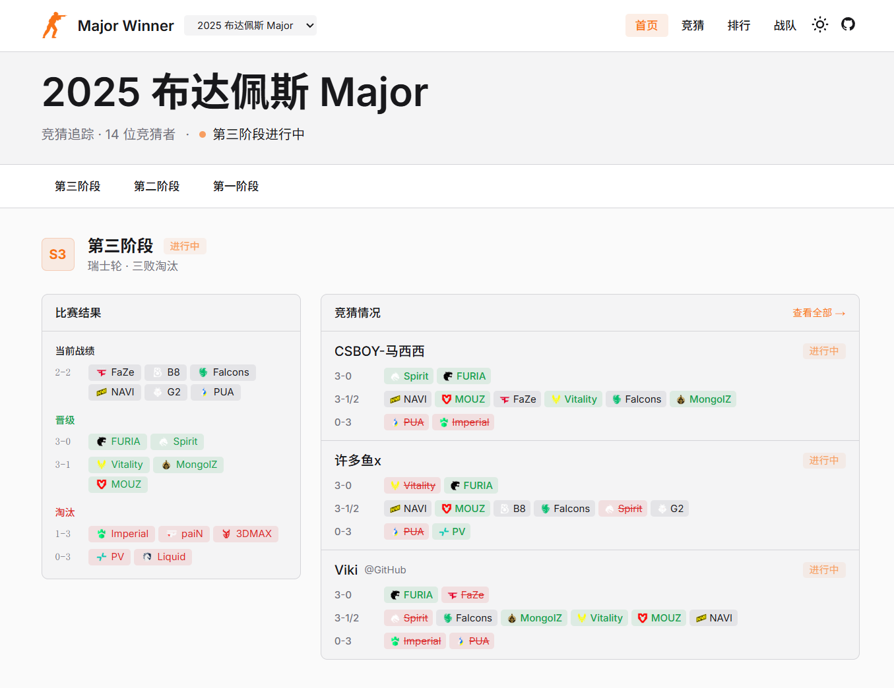
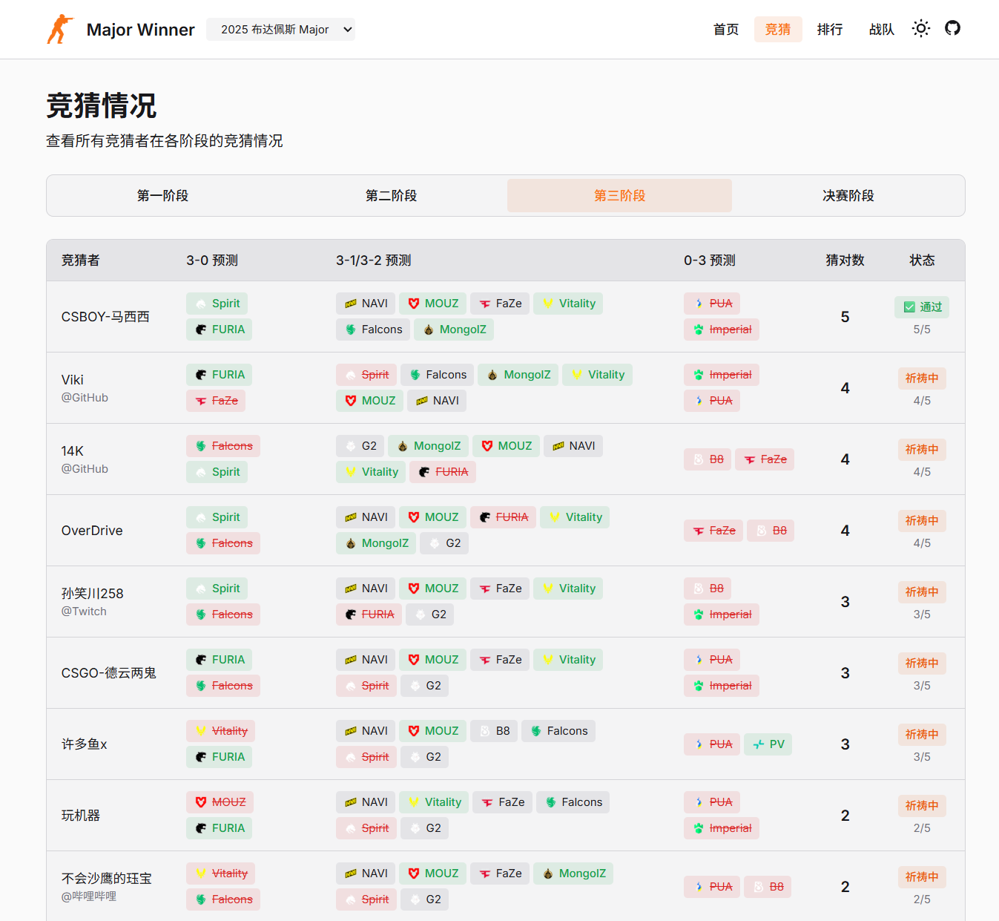
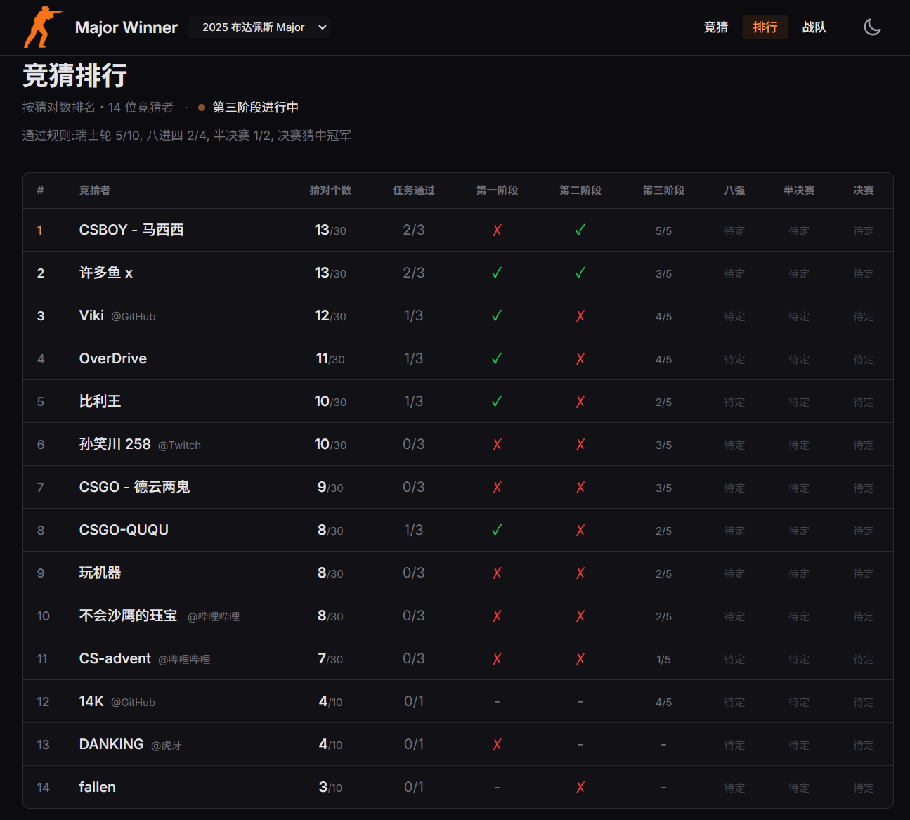
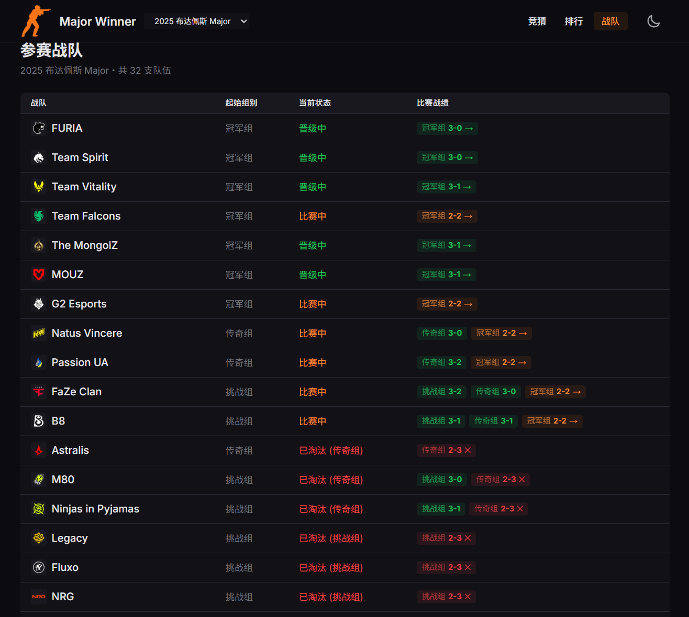

# 🏆 Major Winner

🏆 Counter Strike 2 布达佩斯 Major 竞猜结果 & 排行一览

## 在线查看

- https://major.viki.moe

## 功能截图

  <div style="display: flex; gap: 4px; justify-content: center; align-items: center; flex-wrap: wrap;">
    
    
    
    
  </div>

## 交流群

- QQ 群：[902511365](https://qm.qq.com/q/oiHxyHNfl6) （Major Winner）


## 技术栈

- **Next.js 16** - App Router + React Server Components
- **React 19** - 最新 React 版本
- **TypeScript** - 严格模式
- **Tailwind CSS v4** - 样式系统
- **pnpm** - 包管理器

## 快速开始

```bash
# 安装依赖
pnpm install

# 启动开发服务器
pnpm dev

# 构建生产版本
pnpm build

# 启动生产服务器
pnpm start
```

## 项目特点

- 📊 **数据驱动** - 基于静态 JSON 数据的纯前端应用
- 🌓 **主题切换** - 支持明暗主题自动适配
- 📱 **响应式设计** - 移动优先的自适应布局
- 🎯 **类型安全** - 完整的 TypeScript 类型定义

## 项目结构

```
app/                    # Next.js 页面
├── page.tsx           # 首页：赛段结果 + 预测
├── leaderboard/       # 预测者总排行榜
├── predictors/[id]/   # 预测者详情页
└── compare/           # 预测对比页

components/            # 共享组件
data/                  # 静态数据文件
├── events.json       # 赛事数据
└── predictions.json  # 预测数据

lib/                   # 工具函数
types/                 # TypeScript 类型定义
```

## 数据更新

更新赛事结果只需编辑 `data/events.json`，应用会自动重新计算所有分数和排名。

## License

MIT
